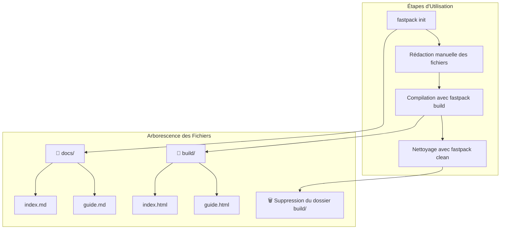

# Introduction

**Fastpack** est un outil de packaging conçu pour automatiser, simplifier et standardiser la préparation de projets web avant déploiement.

Il fournit une suite de commandes pour :

- Initialiser une configuration standard
- Compiler les fichiers source
- Nettoyer les artefacts de build
- Gérer différentes options de configuration

Fastpack est conçu pour être rapide, facile à utiliser, et intégré dans un workflow CI/CD moderne.

## Objectifs

✅ Standardiser les étapes de build  
✅ Réduire la configuration manuelle  
✅ S'adapter à différents types de projets

## Pour qui ?

Développeurs web, intégrateurs, équipes DevOps souhaitant un outil de packaging léger, transparent et scriptable.

---

👉 Commencez par [lire les prérequis](install/prerequisites).
